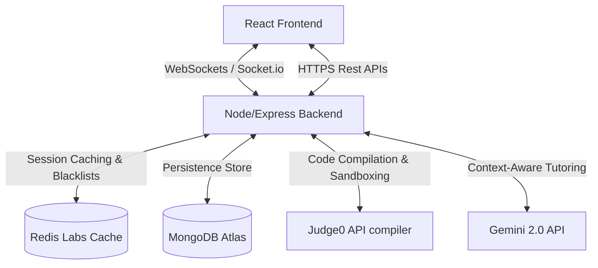

# CodeWinz - Collaborative Competitive Programming Platform

CodeWinz is a full-stack, production-grade online competitive programming and collaborative practice platform. Designed for developers and learners practicing Data Structures and Algorithms (DSA), CodeWinz merges real-time workspace synchronization, gamified contests, and context-aware AI tutor assistance into a cohesive developer ecosystem.

Live Platform: [https://codewinz.vercel.app/](https://codewinz.vercel.app/)

> Note: The backend services are hosted on Render (due to EC2 instance expiration). Please allow 50-60 seconds for the server to spin up and respond on the initial load.

---

## Architectural Overview and System Design

CodeWinz is structured around a distributed, real-time client-server model designed to support low-latency communication and secure code execution:



### 1. Collaborative Code Syncing and Concurrency Control
*   **WebSockets via Socket.IO:** Real-time rooms handle live code sync, cursor positions, selections, and user typing indicators.
*   **Db-Save Debouncing:** To avoid database write bottlenecks, keystrokes are broadcast instantly to peers, but the write-back to MongoDB is debounced (delayed by 1.5 seconds of user idle). If a user disconnects, pending changes are immediately flushed.
*   **Host Control Policies:** The room creator retains administrative rights. Only the host is permitted to toggle code languages, run code, or submit solutions.

### 2. Secure Code Compilation Pipeline
*   **Sandboxed Compilations:** User-submitted code is packaged with metadata and routed to the sandboxed **Judge0 API**.
*   **Multi-Language Execution:** Native compilation support for C++, Java, and JavaScript. Returns standard parameters: `stdout`, `stderr`, runtime performance (ms), memory footprint (KB), and status ID maps.

### 3. Context-Aware AI DSA Tutoring
*   **Restricted Domain Prompts:** Powered by the stable **Gemini 2.0 Flash** model, configured with strict system instructions to only respond to DSA problems loaded in the active workspace.
*   **Persona Customizations:** Styled with a gamified Dragon Ball Z / Goku persona to engage users during debug sessions.

---

## Key Features

### 1. DSA Practice Platform
- Monaco Editor: Integrated in-browser code editor supporting autocomplete, theme customization, and responsive multi-panel layouts.
- Multi-Language Support: Direct support for compiling and executing code written in C++, Java, and JavaScript.
- Execution Analytics: Provides real-time execution statistics including time duration (ms), memory consumption (KB), and standard output/error formatting.

### 2. Real-Time Collaboration
- Shared Workspaces: WebSockets-powered collaborative environments for concurrent problem solving.
- Cursor and Presence Tracking: Real-time broadcast and rendering of peers' active cursors, selections, and typing status.
- Session Management: Room hosts retain permissions for system-changing events such as altering language settings or running final submissions.

### 3. Intelligent AI Assistance
- Problem-Specific Context: In-editor assistant that acts as a tutor, answering queries directly tied to the active DSA challenge.
- Guide-First Prompting: System instructions direct the AI model to explain concepts, check logic, and give hints without outputting the exact solution code directly.

### 4. Interactive Contests and Leaderboards
- Timed Competitions: Participate in scheduling-based coding contests with dynamic countdowns.
- Automatic Leaderboard System: Instantaneous score calculations based on difficulty weightings and test cases passed.

### 5. Administrative Control Panel
- Content Management: Dedicated interface for admins to create, read, update, and delete problems, test cases, and difficulty distributions.

---

## Tech Stack and Rationale

| Component | Technology | Rationale |
| :--- | :--- | :--- |
| **Frontend** | React.js (Vite) | Single Page Application framework with optimal DOM rendering, quick state reconciliation, and fast static builds. |
| **Styling** | Tailwind CSS & DaisyUI | Utility-first styling for a customized, responsive glassmorphism/stealth monochrome layout. |
| **Backend** | Node.js & Express.js | Event-driven, non-blocking I/O model built to scale real-time WebSocket requests. |
| **Database** | MongoDB & Mongoose | Document-oriented database for flexible indexing of problems, user stats, and dynamic contest state changes. |
| **Real-time Engine**| Socket.IO | High-performance WebSockets client-server layer for rooms, chat notifications, and low-latency cursor tracking. |
| **Token Control** | Redis | In-memory data store used for listing invalidated JWT tokens during logout sequences. |
| **E-mail Engine** | Brevo API & Nodemailer | Outbound transactional mailer used for sending passwordless secure magic sign-in links. |

---

## Security Architecture

- Secure Session Authentication: JWT-based authorization utilizing passwordless magic link distribution via SMTP.
- Google One Tap OAuth: Secure validation workflow checking Google tokens on the backend.
- Session Invalidation: Blocklisting layer using Redis cache memory to invalidate active JWTs upon explicit logouts.

---

## Local Development Setup

To run the client and server applications on your local environment, follow the steps below:

### Prerequisites

Ensure you have the following installed on your system:
* Node.js (v18 or higher)
* npm or yarn
* A running MongoDB database (local instance or MongoDB Atlas)
* A running Redis instance (local or hosted)

---

### 1. Backend Configuration

1. **Navigate to the Backend Directory:**
   ```bash
   cd "Codewinz backend"
   ```

2. **Install Dependencies:**
   ```bash
   npm install
   ```

3. **Configure Environment Variables:**
   Create a `.env` file in the root of the backend directory and populate it with the following format:
   ```env
   # Server Port
   PORT=3000

   # Database Connection
   DB_CONNECT_STRING=mongodb://127.0.0.1:27017/codewinz

   # Authentication & JWT Security
   JWT_KEY=your_secure_jwt_secret_key
   COOKIE_SECRET=your_cookie_signing_secret

   # Redis Configuration
   REDIS_HOST=127.0.0.1
   REDIS_PASS=your_redis_password

   # External Compiler API (Judge0)
   JUDGE0_URL=https://ce.judge0.com

   # AI Integration (Google Gemini API Key)
   GEMINI_KEY=your_gemini_api_key_from_google_ai_studio

   # Google OAuth Credentials
   GOOGLE_CLIENT_ID=your_google_oauth_client_id

   # Application Endpoints
   FRONTEND_URL=http://localhost:5173
   BACKEND_URL=http://localhost:3000

   # Outbound SMTP Configuration (e.g. Brevo)
   BREVO_KEY=your_brevo_api_key
   MAIL_FROM=your_sender_email_address

   # Media Management (Cloudinary)
   CLOUDINARY_CLOUD_NAME=your_cloudinary_cloud_name
   CLOUDINARY_API_KEY=your_cloudinary_api_key
   CLOUDINARY_API_SECRET=your_cloudinary_api_secret
   ```

4. **Start the Backend Server:**
   ```bash
   npm run dev
   ```

---

### 2. Frontend Configuration

1. **Navigate to the Frontend Directory:**
   ```bash
   cd "Codewinz frontend"
   ```

2. **Install Dependencies:**
   ```bash
   npm install
   ```

3. **Configure Environment Variables:**
   Create a `.env` file in the root of the frontend directory and populate it with the following variables:
   ```env
   VITE_GOOGLE_CLIENT_ID=your_google_oauth_client_id
   VITE_BACKEND_URL=http://localhost:3000
   VITE_FRONTEND_URL=http://localhost:5173
   VITE_API_URL=http://localhost:3000
   VITE_SOCKET_SERVER_URL=http://localhost:3000
   ```

4. **Start the Development Server:**
   ```bash
   npm run dev
   ```
   Open [http://localhost:5173](http://localhost:5173) in your browser.

---

## Project Links

- **GitHub Repository:** [https://github.com/Aayush132004/Codewinz.0](https://github.com/Aayush132004/Codewinz.0)
- **Live Site:** [https://codewinz.vercel.app/](https://codewinz.vercel.app/)

---

## Author

**Aayush Sharma**  
B.Tech CSE @ IIIT Bhopal  
Email: [aayush.iiitbhopal@gmail.com](mailto:aayush.iiitbhopal@gmail.com)  
Links: [LinkedIn](your-linkedin-link) | [GitHub](your-github-link)
